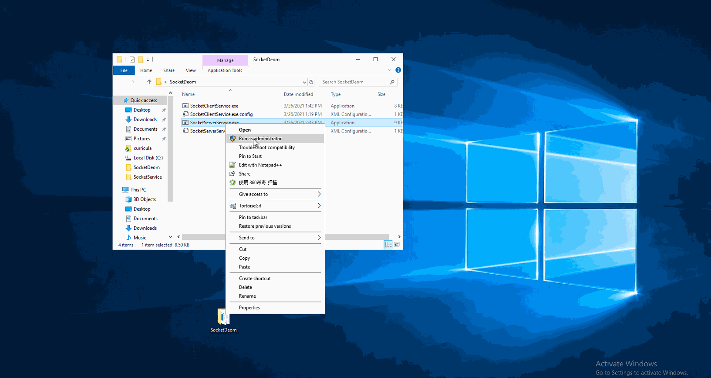

# Socket Demo

## Build a socket solution which includes following functions:

### Build a socket server which receives message from client side.

    1. Create a thread for each received message.

    2. Write received message to audit.xml, includes current thread id and all message content with XML format.

    3. Socket server must have ability to handle message from several clients at the same time.

### Build a socket client which sends message to server side,

    1. Message includes message content, sending time, user name and email address of the user who sends message.

    2. Email address need to be user input, and necesary validation is required.

    3. User can choose to send another message or quit current session.

### Check out code from master branch to you branch.

### The client and server applications can work on different computers. 

    1. Use classes and interfaces to implement the features.

    2. The program should be able handle normal exceptions.

    3. Please provide necessary output and logging.

    4. Program should be able to run on different environments without rebuilding solution.

    5. Process crush IS NOT accepted.

## Demostration
The following demo is an uncomplete version, and for reference only. You need to design the message and message format from user perspective.  
 

